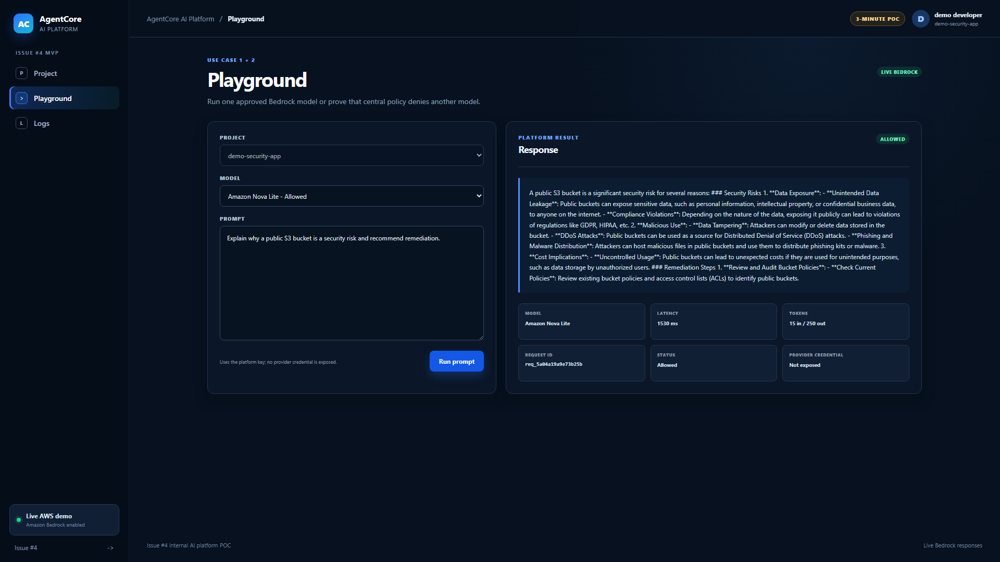
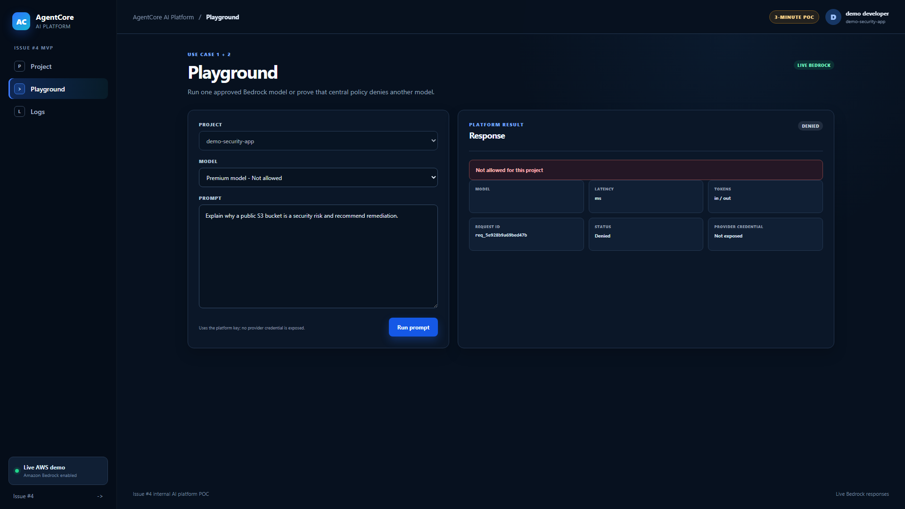
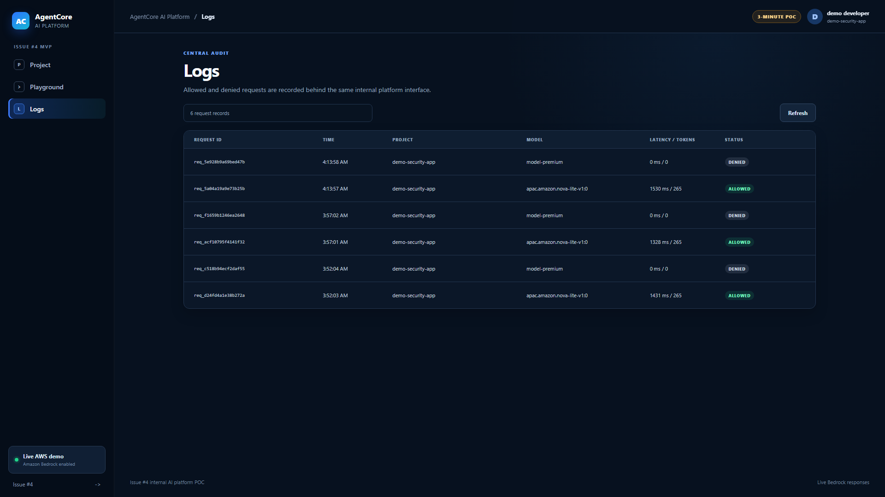

<!-- _class: lead -->

# Access. Govern. Prove.

### A 3-minute internal AI platform POC

One project. One platform key. One approved model. One visible policy boundary.

<span class="proof">DEMO-PROVEN</span>

---

## Why now

Teams want useful AI access without distributing cloud credentials or letting
every application choose any model.

- **Developer experience:** one small platform interface
- **Governance:** project-to-model allowlist before inference
- **Evidence:** allowed and denied decisions in the same audit view

> The POC tests the pattern, not an enterprise platform.

---

## The 3-minute operating loop

<p class="flow">Create key &nbsp;&rarr;&nbsp; Select model &nbsp;&rarr;&nbsp; Enforce policy &nbsp;&rarr;&nbsp; Invoke or deny &nbsp;&rarr;&nbsp; Record</p>

1. Create the single-use demo platform key.
2. Run the approved **Amazon Nova Lite** model.
3. Select a premium model and show central denial.
4. Open Logs and compare both decisions.

<span class="proof">DEMO-PROVEN</span>

---

## Trust boundary

```text
Developer browser
  platform key only
        |
        v
API Gateway -> Lambda policy gate -> Amazon Bedrock
                    |
                    +-> DynamoDB key hash + request audit
```

- The developer never receives an AWS or provider credential. **DEMO-PROVEN**
- The live key record contains a SHA-256 hash, not the raw key. **READ-ONLY PROVEN**
- A denied model is stopped by policy before Bedrock invocation. **TEST-PROVEN**

---

## Approved request reaches Nova Lite

<span class="proof">DEMO-PROVEN</span>

The platform returns the answer plus model, latency, token counts, request ID,
status, and explicit provider-credential isolation.



---

## The same key cannot bypass policy

<span class="proof">DEMO-PROVEN</span>

Selecting the premium model produces a clear **Denied** result with no provider
credential exposed and no model tokens consumed.



---

## One audit view shows both outcomes

<span class="proof">DEMO-PROVEN</span>

Allowed and denied requests are visible together with project, model, latency,
tokens, request ID, time, and status.



---

## Proof boundary

| Evidence state | What it supports |
|---|---|
| **DEMO-PROVEN** | Live key, Nova Lite response, policy denial, combined logs |
| **TEST-PROVEN** | Three routes, zero unexpected console errors, exact browser cleanup |
| **READ-ONLY PROVEN** | TTL-bound stack inventory and hash-only key record |
| **NOT PROVEN** | Production auth, rotation, multi-tenancy, billing, resilience |

This is intentionally a **POC/MVP**, not GovTech Platform AI feature parity.

---

## Decision: accept, extend once, or stop

The POC demonstrates that one platform credential can provide useful model
access while a central policy gate controls and records the outcome.

<span class="proof planned">PLANNED</span>

Consider one tiny Issue #5 only after Issue #4 is accepted as a working demo.

<span class="proof not-proven">NOT PROVEN</span>

No claim is made that this public, TTL-bound demo stack is production-ready.
